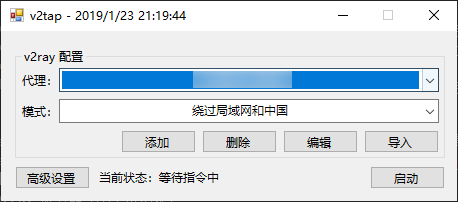
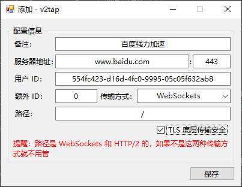
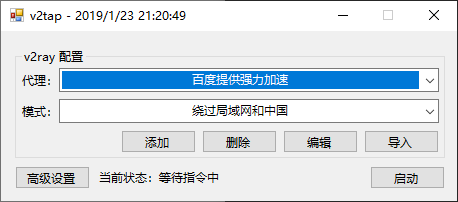

# v2tap
TUN/TAP + tun2socks + v2ray 实现的 VPN 工具

# 待完成
- 自动安装 TUN/TAP 驱动程序
- 全新的界面

# 依赖文件
- [tap-windows-latest-stable](https://build.openvpn.net/downloads/releases/latest/tap-windows-latest-stable.exe)
- [RunHiddenConsole](https://redmine.lighttpd.net/attachments/660/RunHiddenConsole.zip)
- [v2ray-core](https://github.com/v2ray/v2ray-core/releases)
- [tun2socks](https://raw.githubusercontent.com/hacking001/v2tap/master/binaries/tun2socks.exe)

# 准备工作
在 [releases](https://github.com/hacking001/v2tap/releases) 里有打包好的
- 将依赖文件准备好，和 `v2tap.exe` 一起摆放成如下样子

- 安装 [tap-windows-latest-stable.exe](https://build.openvpn.net/downloads/releases/latest/tap-windows-latest-stable.exe)，一路 next 即可
- 可用的 v2ray 服务器

# 检查工作
- 检查适配器列表中是否多出了一个新的适配器

# 正式开始
1. 打开 `v2tap.exe` 输入你的服务器配置信息（已支持保存配置，图片没有更新，releases 中已发布）

2. 检查最底下的适配器部分是否是你当前的内网 IP 和网关。如果不是，请手动正确选择

3. 点击启动按钮即可
4. 检查 [Google](https://www.google.com/ncr) 是否可以正常访问
